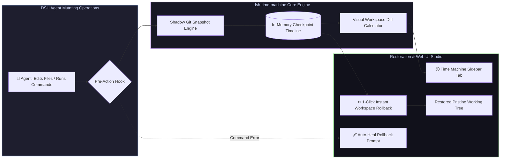

# 📦 @goodandready/dsh-time-machine

<div align="center">

<h3>Automated Shadow Git Snapshots, Workspace Time-Travel & Instant Rollback for DeepSeek Harness</h3>

<p align="center">
  <a href="https://www.npmjs.com/package/@goodandready/dsh-time-machine"></a>
  <a href="LICENSE"></a>
  <a href="https://github.com/topics/dsh-plugin"></a>
  <a href="https://nodejs.org"></a>
</p>

<!-- Showcase Catalog Button -->
<p align="center">
  <a href="https://goodandready.app/"></a>
</p>

<p align="center">
  <a href="README.md"><b>🇬🇧 English</b></a> •
  <a href="README.ru.md"><b>🇷🇺 Русский</b></a> •
  <a href="README.zh.md"><b>🇨🇳 中文说明</b></a>
</p>

</div>

---

## ⚡ Overview

**`dsh-time-machine`** provides an automated safety net and instantaneous rollback engine for **DeepSeek Harness** workspaces.

Autonomous agents frequently execute complex multi-file refactorings, run mutating shell commands, or install dependencies. When an unexpected regression or broken state occurs, manual git reversion can be messy and risk losing untracked files or user git history.

`dsh-time-machine` creates lightweight **shadow git snapshots** in the background without modifying user git commits or branches, providing **1-click interactive rollback, visual file diffs, and automatic recovery prompts on command failure**.



---

## ✨ Key Capabilities & Studio Features

### 1. 🛡️ Non-Intrusive Shadow Git Snapshots (`lib/snapshot.js`)
* Captures complete working tree state, staged files, and untracked assets using shadow git refs;
* Zero pollution of user git commit history, tags, or active branches;
* Retains a rolling history of the last $N$ checkpoints with human-readable labels and timestamps.

### 2. ⏪ Instant Safe Rollback (`time_machine_checkpoint_rollback`)
* Restores the entire workspace or specific files to any previous checkpoint in milliseconds;
* Can be triggered programmatically by the agent or interactively by the user in the UI.

### 3. 🔍 Visual Snapshot Diff Inspector (`time_machine_diff`)
* Computes file-by-file visual diffs comparing current workspace state against any checkpoint;
* Highlights added, deleted, and modified lines with clean line numbers.

### 4. 🕒 Interactive Sidebar Timeline (`lib/client.js`)
* Seamlessly integrates into DSH Web UI sidebar;
* Displays a chronological timeline of all session checkpoints with file change counters and 1-click "Restore Checkpoint" and "Inspect Diff" buttons.

### 5. 🩹 Auto-Heal on Command Failure
* Automatically prompts the user/agent with a 1-click restore proposal when a destructive command exits with an error.

---

## 🛠️ Agent Tools Reference (4 Tools)

| Tool Name | Parameters | Description |
|---|---|---|
| `time_machine_checkpoint_create` | `label?: string` | Creates a shadow git workspace checkpoint before risky edits or operations |
| `time_machine_checkpoint_list` | *(none)* | Lists all recent workspace checkpoints newest first |
| `time_machine_checkpoint_rollback` | `id: string` | Reverts the entire workspace back to the specified checkpoint state |
| `time_machine_diff` | `id?: string` | Returns unified file diff between current workspace and target checkpoint |

---

## 📦 Quick Installation

```bash
dsh plugin --profile web add @goodandready/dsh-time-machine
```

---

## ⚙️ Configuration Reference (`settings.yaml`)

```yaml
dsh-time-machine:
  autoSnapshotEnabled: true    # Automatically take checkpoints before file modifications
  maxSnapshots: 20             # Maximum rolling checkpoints retained in memory
  autoHealPrompt: true         # Prompt for rollback when a command fails
```

---

## 📄 License

MIT © [GooDAnDReaDY](https://github.com/GooDAnDReaDY)
