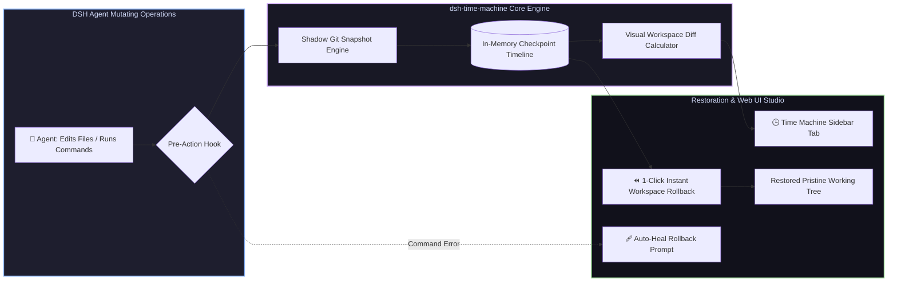

# 📦 @goodandready/dsh-time-machine

<div align="center">

<h3>Automated Shadow Git Snapshots, Workspace Time-Travel & Instant Rollback for DeepSeek Harness</h3>

<p align="center">
  <a href="https://www.npmjs.com/package/@goodandready/dsh-time-machine"></a>
  <a href="LICENSE"></a>
  <a href="https://github.com/topics/dsh-plugin"></a>
  <a href="https://nodejs.org"></a>
</p>

<!-- Showcase Catalog Button -->
<p align="center">
  <a href="https://goodandready.app/"></a>
</p>

<p align="center">
  <a href="README.md"><b>🇬🇧 English</b></a> •
  <a href="README.ru.md"><b>🇷🇺 Русский</b></a> •
  <a href="README.zh.md"><b>🇨🇳 中文说明</b></a>
</p>

</div>

---

## ⚡ Overview

**`dsh-time-machine`** provides an automated safety net and instantaneous rollback engine for **DeepSeek Harness** workspaces.

Autonomous agents frequently execute complex multi-file refactorings, run mutating shell commands, or install dependencies. When an unexpected regression or broken state occurs, manual git reversion can be messy and risk losing untracked files or user git history.

`dsh-time-machine` creates lightweight **shadow git snapshots** in the background without modifying user git commits or branches, providing **1-click interactive rollback, visual file diffs, and automatic recovery prompts on command failure**.



---

## 🌟 Key Capabilities

### 1. 🛡️ Lightweight Shadow Git Snapshots
* Captures the full working tree, staged changes, and untracked files using isolated Git shadow tree references;
* Zero interference with user commit history, current active branch, or repository staging area;
* Maintains a rolling history of the most recent checkpoints with clear timestamps, session scoping, and labels.

### 2. ⏪ Instant Safe Rollback (`time_machine_checkpoint_rollback`)
* Restores the entire workspace or specific files to any previous checkpoint in milliseconds;
* Uses non-destructive checkout-index and clean without moving `HEAD` or rewriting branch history;
* Can be triggered programmatically by the agent or interactively by the user in the UI.

### 3. 🔍 Visual Snapshot Diff Inspector (`time_machine_diff`)
* Computes file-by-file visual diffs comparing current workspace state against any checkpoint;
* Highlights added, deleted, and modified lines with clean line numbers and statistics.

### 4. 🕒 Interactive Sidebar & Settings Timeline (`lib/client.js`)
* Seamlessly integrates into DSH Web UI sidebar and settings tab;
* Displays a chronological timeline of session checkpoints with 1-click "Rollback", "Diff", and "Delete" buttons.

### 5. 🩹 Auto-Heal on Command Failure
* Automatically records checkpoints when a tool or command fails, preserving recovery options.

---

## 🛠️ Agent Tools Reference (6 Tools)

| Tool Name | Parameters | Description |
|---|---|---|
| `time_machine_checkpoint_create` | `label?: string, sessionId?: string` | Creates a shadow git workspace checkpoint before risky edits or operations |
| `time_machine_checkpoint_list` | `sessionId?: string` | Lists all recent workspace checkpoints newest first |
| `time_machine_checkpoint_rollback` | `id: string, confirm: boolean` | Safely reverts workspace files back to specified checkpoint without altering branch HEAD |
| `time_machine_diff` | `from: string, to?: string` | Returns unified file diff between current workspace and target checkpoint |
| `time_machine_checkpoint_delete` | `id: string, confirm: boolean` | Permanently deletes a single checkpoint and purges its git reference |
| `time_machine_checkpoint_prune` | `sessionId?: string, keep?: number` | Prunes session checkpoints, keeping only the newest N checkpoints |

---

## 📦 Quick Installation

```bash
dsh plugin --profile web add @goodandready/dsh-time-machine
```

---

## ⚙️ Configuration Reference (`settings.yaml`)

```yaml
dsh-time-machine:
  autoSnapshotEnabled: true    # Automatically take checkpoints before file modifications
  maxSnapshots: 20             # Maximum rolling checkpoints retained in memory
  autoHealPrompt: true         # Prompt for rollback when a command fails
```

---

## 📋 Release Notes

### v0.1.12 — Fix Oversized Clock Icon in Native Sidebar Guide
* **Fixed in v0.1.12**: Replaced function-based icon with dedicated `TimeMachineIcon` component supporting both props object `{ size, className }` and numeric argument, with explicit inline sizing (`width`, `height`, `display: inline-block`, `flex: none`) to prevent overflow in the Right Sidebar Guide card.

### v0.1.11 — Dual Sidebar Support: Native DSH Right Sidebar & BetterSidebar
* **Added in v0.1.11**: Support for native DSH Right Sidebar (`sidebarRightTabs` + `sidebar.right.pane.tab`) introduced in DSH 0.1.5-alpha.1, including guide page registration with custom icon.
* **Preserved in v0.1.11**: Legacy `betterSidebar` integration retained with deterministic surface-scoped registrations, preventing ID collisions or duplicate mounts when both surfaces exist.
* **Added in v0.1.11**: Graceful degradation to plugin settings card when neither sidebar surface is available.

### v0.1.10 — Stability, Dynamic CWD, Unified Diff & Architecture Polish
* **Added in v0.1.10**: Dynamic / session-aware `cwd` resolution: TimeMachine tools and REST endpoints automatically locate the active session workspace or accept explicit target directory.
* **Added in v0.1.10**: Unified diff support (`format: "patch" | "stat"`) with size limits (up to 256KB) and clean truncation warnings.
* **Added in v0.1.10**: Async execution queue on Git mutation engine to completely eliminate lockfile collisions under concurrent agent operations.
* **Added in v0.1.10**: Single-batch Git ref querying using `git for-each-ref` replacing $O(N)$ sequential `git log` processes for instant snapshot listings.
* **Added in v0.1.10**: Redundant commit deduplication: auto-snapshots are safely skipped if the working tree has not changed.
* **Added in v0.1.10**: Startup cleanup of temporary `tm_index_*` staging files.
* **Changed in v0.1.10**: Settings UI card streamlined, directing snapshot inspection to the dedicated Time Machine sidebar tab.
* **Changed in v0.1.10**: Comprehensive error logging replacing silent exceptions.

### v0.1.9 — Event Bus Harmonization & Dependency Cleanup
* **Changed in v0.1.9**: Harmonized event bus subscriptions to prevent duplicate checkpoints. Native DSH `session/event` bus takes precedence, with legacy `ctx.events` used strictly as a fallback when `ctx.on` is unavailable.
* **Changed in v0.1.9**: Removed unused `@deepseek-ai/dsh-credentials` from `peerDependencies`.
* **Added in v0.1.9**: Standardized project design contract in `docs/design/DESIGN.md`.

### v0.1.7 — Critical Safety, Staging Isolation & Native Event Bus
* **Changed in v0.1.7**: Safe workspace rollback via `read-tree` + `checkout-index` + `clean -fd`. Rolling back to a checkpoint never modifies branch `HEAD` or severs git commit history.
* **Changed in v0.1.7**: User staging area protection. Checkpoints now isolate git index creation through `GIT_INDEX_FILE`, preventing disruption of pre-staged files in `.git/index`.
* **Changed in v0.1.7**: Native DSH session event integration. Subscribed to `session/event` bus for automated checkpoints on `turn/start`, `approval/asked`, `turn/end`, and command errors.
* **Changed in v0.1.7**: Automatic Git ref cleanup on snapshot eviction to eliminate disk ref leaks.
* **Changed in v0.1.7**: Direct working directory diff computation when comparing checkpoints with uncommitted changes.
* **Changed in v0.1.7**: Strict compliance with DSH Plugin Authoring guidelines: form fields are enabled only when settings status is `ready`.
* **Added in v0.1.7**: WebServer request body size limit (1MB max payload) for DoS protection.
* **Added in v0.1.7**: Complete Chinese localization (`zh`) in frontend interface.

---

## 📄 License

MIT © [GooDAnDReaDY](https://github.com/GooDAnDReaDY)