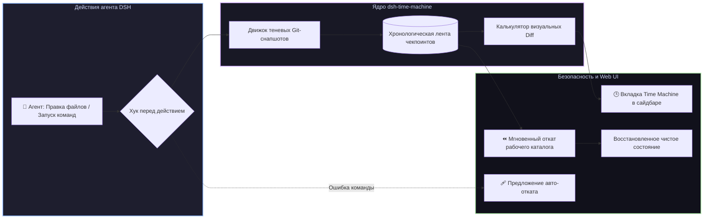

# 📦 @goodandready/dsh-time-machine

<div align="center">

<h3>Автоматические теневые снапшоты, путешествие во времени по кодовой базе и мгновенный откат изменений для DeepSeek Harness</h3>

<p align="center">
  <a href="https://www.npmjs.com/package/@goodandready/dsh-time-machine"></a>
  <a href="LICENSE"></a>
  <a href="https://github.com/topics/dsh-plugin"></a>
  <a href="https://nodejs.org"></a>
</p>

<!-- Обязательная кнопка перехода на витрину всех проектов -->
<p align="center">
  <a href="https://goodandready.app/"></a>
</p>

<p align="center">
  <a href="README.md"><b>🇬🇧 English</b></a> •
  <a href="README.ru.md"><b>🇷🇺 Русский</b></a> •
  <a href="README.zh.md"><b>🇨🇳 中文说明</b></a>
</p>

</div>

---

## ⚡ Обзор

**`dsh-time-machine`** предоставляет автоматическую систему безопасности и мгновенного отката для рабочего пространства агентов **DeepSeek Harness**.

Автономные агенты часто выполняют сложные рефакторинги множества файлов, выполняют терминальные команды или устанавливают пакеты. В случае ошибок или поломки кода ручной откат через git может быть затруднён и грозит потерей неотслеживаемых файлов или порчей истории коммитов.

`dsh-time-machine` создаёт легковесные **теневые снапшоты (shadow git snapshots)** в фоновом режиме без изменения пользовательских веток и коммитов, обеспечивая **откат в 1 клик, визуальный просмотр Diff и предложение авто-восстановления при сбоях**.



---

## 🌟 Ключевые возможности

### 1. 🛡️ Легковесные теневые Git-снапшоты
* Фиксирует всё рабочее дерево, индексированные и новые файлы через изолированные shadow-ссылки Git;
* Не создаёт лишних коммитов в пользовательской истории, не переключает активные ветки и не сдвигает указатель `HEAD`;
* Изолирует рабочий индекс `.git/index` от фонового сохранения чекпоинтов через переменную `GIT_INDEX_FILE`;
* Хранит скользящую историю последних $N$ чекпоинтов с понятными метками, сессионной привязкой и метками времени.

### 2. ⏪ Мгновенный безопасный откат (`time_machine_checkpoint_rollback`)
* Возвращает всё рабочее пространство к любому предыдущему состоянию за миллисекунды;
* Не затирает историю веток Git: откат выполняется через безопасный `read-tree` + `checkout-index` + `clean -fd`;
* Может вызываться как программно агентом, так и пользователем через кнопку в интерфейсе.

### 3. 🔍 Визуальный инспектор Diff (`time_machine_diff`)
* Сравнивает текущие файлы рабочего каталога со снапшотом и формирует наглядный пофайловый Diff.

### 4. 🕒 Интерактивная хроника в сайдбаре и настройках (`lib/client.js`)
* Встраивается в боковую панель Web UI DSH и карточку настроек плагинов;
* Показывает список чекпоинтов с кнопками «Откатить», «Сравнить Diff» и «Удалить».

### 5. 🩹 Авто-восстановление при сбоях команд
* Автоматически фиксирует контрольную точку при сбоях выполнения инструментов и команд.

---

## 🛠️ Инструменты агента (6 инструментов)

| Имя инструмента | Параметры | Описание |
|---|---|---|
| `time_machine_checkpoint_create` | `label?: string, sessionId?: string` | Создаёт теневой чекпоинт перед рискованными правками |
| `time_machine_checkpoint_list` | `sessionId?: string` | Возвращает список недавних снапшотов от новых к старым |
| `time_machine_checkpoint_rollback` | `id: string, confirm: boolean` | Безопасно откатывает файлы рабочего пространства без изменения HEAD ветки |
| `time_machine_diff` | `from: string, to?: string` | Возвращает пофайловый Diff между текущим состоянием и чекпоинтом |
| `time_machine_checkpoint_delete` | `id: string, confirm: boolean` | Удаляет отдельный чекпоинт и очищает соответствующий Git ref |
| `time_machine_checkpoint_prune` | `sessionId?: string, keep?: number` | Прореживает чекпоинты сессии, сохраняя указанное количество самых свежих |

---

## 📦 Быстрая установка

```bash
dsh plugin --profile web add @goodandready/dsh-time-machine
```

---

## ⚙️ Пример конфигурации (`settings.yaml`)

```yaml
dsh-time-machine:
  autoSnapshotEnabled: true    # Создавать чекпоинты перед изменением файлов
  maxSnapshots: 20             # Максимальное количество чекпоинтов в памяти
  autoHealPrompt: true         # Предлагать откат при падении терминальной команды
```

---

## 📋 История версий (Release Notes)

### v0.1.9 — Гармонизация шины событий и очистка зависимостей
* **Changed in v0.1.9**: Устранено потенциальное дублирование авто-снапшотов. Нативная шина событий DSH `session/event` теперь имеет приоритет, а legacy `ctx.events` подключается строго как fallback при отсутствии `ctx.on`.
* **Changed in v0.1.9**: Удалена неиспользуемая зависимость `@deepseek-ai/dsh-credentials` из `peerDependencies`.
* **Added in v0.1.9**: Добавлен дизайн-контракт проекта `docs/design/DESIGN.md`.

### v0.1.7 — Безопасность истории веток, изоляция индекса и события DSH
* **Changed in v0.1.7**: Безопасный откат рабочего каталога через `read-tree` + `checkout-index` + `clean -fd`. Устранена критическая проблема переноса `HEAD` ветки на сиротский коммит.
* **Changed in v0.1.7**: Защита пользовательского индекса Git. Чекпоинты создаются с изолированным `GIT_INDEX_FILE`, предотвращая перезапись подготовленных файлов в `.git/index`.
* **Changed in v0.1.7**: Поддержка нативной шины событий DSH `session/event` для автоматических чекпоинтов на `turn/start`, `approval/asked`, `turn/end` и аварийных снапшотов при ошибках.
* **Changed in v0.1.7**: Автоматическое удаление ссылок `refs/dsh-time-machine/...` из Git при вытеснении старых чекпоинтов по лимиту `maxSnapshots`.
* **Changed in v0.1.7**: Корректный расчет Diff напрямую относительно рабочей директории с незакоммиченными изменениями.
* **Changed in v0.1.7**: Соответствие стандартам DSH Plugin Authoring: поля формы настроек разблокированы строго в состоянии `ready`.
* **Added in v0.1.7**: Защита WebServer API от DoS-атак через лимит тела запроса (макс. 1 МБ).
* **Added in v0.1.7**: Полная китайская локализация интерфейса (`zh`).

---

## 📄 Лицензия

MIT © [GooDAnDReaDY](https://github.com/GooDAnDReaDY)