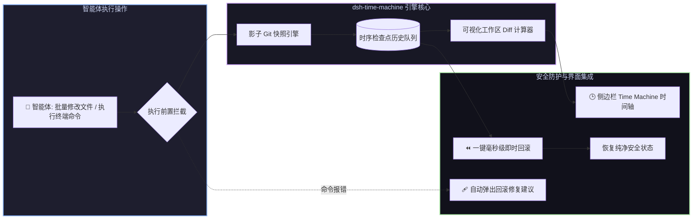

# 📦 @goodandready/dsh-time-machine

<div align="center">

<h3>DeepSeek Harness 自动化影子 Git 快照、工作区时光机与一键即时回滚插件</h3>

<p align="center">
  <a href="https://www.npmjs.com/package/@goodandready/dsh-time-machine"></a>
  <a href="LICENSE"></a>
  <a href="https://github.com/topics/dsh-plugin"></a>
  <a href="https://nodejs.org"></a>
</p>

<!-- 官方展示中心跳转按钮 -->
<p align="center">
  <a href="https://goodandready.app/"></a>
</p>

<p align="center">
  <a href="README.md"><b>🇬🇧 English</b></a> •
  <a href="README.ru.md"><b>🇷🇺 Русский</b></a> •
  <a href="README.zh.md"><b>🇨🇳 中文说明</b></a>
</p>

</div>

---

## ⚡ 插件概览

**`dsh-time-machine`** 为 **DeepSeek Harness** 智能体提供全自动工作区安全护栏与即时状态回滚引擎。

智能体在执行多文件批量重构、依赖安装或高危终端命令时，一旦发生代码损坏或逻辑回归，手动 Git 回退不仅繁琐，还容易丢失未跟踪的新建文件。

本插件在后台利用**影子 Git 快照技术（Shadow Git Snapshots）**自动捕获工作区状态，不污染用户 Git 提交树与分支，支持**一键即时回退、可视化文件 Diff 对比以及命令失败时的主动自愈挽救**。



---

## 📦 安装指南

```bash
dsh plugin --profile web add @goodandready/dsh-time-machine
```

---

## 📄 开源协议

MIT © [GooDAnDReaDY](https://github.com/GooDAnDReaDY)
