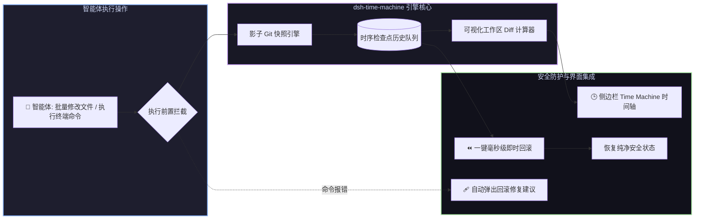

# 📦 @goodandready/dsh-time-machine

<div align="center">

<h3>面向 DeepSeek Harness 的影子 Git 自动快照、工作区时间旅行与即时回滚引擎</h3>

<p align="center">
  <a href="https://www.npmjs.com/package/@goodandready/dsh-time-machine"></a>
  <a href="LICENSE"></a>
  <a href="https://github.com/topics/dsh-plugin"></a>
  <a href="https://nodejs.org"></a>
</p>

<!-- 作者所有开源项目目录按钮 -->
<p align="center">
  <a href="https://goodandready.app/"></a>
</p>

<p align="center">
  <a href="README.md"><b>🇬🇧 English</b></a> •
  <a href="README.ru.md"><b>🇷🇺 Русский</b></a> •
  <a href="README.zh.md"><b>🇨🇳 中文说明</b></a>
</p>

</div>

---

## ⚡ 插件概览

**`dsh-time-machine`** 为 **DeepSeek Harness** 智能体提供全自动工作区安全护栏与即时状态回滚引擎。

智能体在执行多文件批量重构、依赖安装或高危终端命令时，一旦发生代码损坏或逻辑回归，手动 Git 回退不仅繁琐，还容易丢失未跟踪的新建文件。

本插件在后台利用**影子 Git 快照技术（Shadow Git Snapshots）**自动捕获工作区状态，不污染用户 Git 提交树与分支，支持**一键即时回退、可视化文件 Diff 对比以及命令失败时的主动自愈挽救**。



---

## 🛠️ 智能体工具列表 (6 个工具)

| 工具名称 | 参数 | 说明 |
|---|---|---|
| `time_machine_checkpoint_create` | `label?: string, sessionId?: string` | 在高危修改前创建影子 Git 检查点快照 |
| `time_machine_checkpoint_list` | `sessionId?: string` | 按时间倒序列出最近的工作区检查点 |
| `time_machine_checkpoint_rollback` | `id: string, confirm: boolean` | 安全还原工作区文件至指定检查点（不移动分支 HEAD） |
| `time_machine_diff` | `from: string, to?: string` | 对比当前工作区文件与目标检查点的文件差异 |
| `time_machine_checkpoint_delete` | `id: string, confirm: boolean` | 删除指定检查点并同步清理 Git 引用 |
| `time_machine_checkpoint_prune` | `sessionId?: string, keep?: number` | 清理会话过期检查点，保留指定数量的最新快照 |

---

## 📦 安装指南

```bash
dsh plugin --profile web add @goodandready/dsh-time-machine
```

---

## ⚙️ 配置说明 (`settings.yaml`)

```yaml
dsh-time-machine:
  autoSnapshotEnabled: true    # 文件修改前自动创建快照
  maxSnapshots: 20             # 内存保留的最大滚动检查点数量
  autoHealPrompt: true         # 终端命令执行失败时提示回滚
```

---

## 📋 版本更新记录 (Release Notes)

### v0.1.9 — 事件总线统一与依赖清理
* **Changed in v0.1.9**: 统一事件总线监听逻辑，杜绝自动快照重复触发。优先使用原生 DSH `session/event` 总线，仅在缺失 `ctx.on` 时启用 legacy `ctx.events` 回退。
* **Changed in v0.1.9**: 从 `peerDependencies` 中移除未使用的 `@deepseek-ai/dsh-credentials`。
* **Added in v0.1.9**: 新增项目设计规范文档 `docs/design/DESIGN.md`。

### v0.1.7 — 分支历史安全、暂存区隔离与 DSH 原生事件总线
* **Changed in v0.1.7**: 安全工作区回滚。改用 `read-tree` + `checkout-index` + `clean -fd`，彻底杜绝回滚时误将分支 `HEAD` 覆盖为孤立提交的严重缺陷。
* **Changed in v0.1.7**: 保护用户 Git 暂存区。快照操作通过独立的 `GIT_INDEX_FILE` 执行，不会覆盖 `.git/index` 中已暂存的文件。
* **Changed in v0.1.7**: 原生对接 DSH `session/event` 事件总线，全面激活 `turn/start`、`approval/asked`、`turn/end` 和错误自愈事件监听。
* **Changed in v0.1.7**: 修复快照淘汰时的 Git 引用泄露问题，自动执行 `git update-ref -d`。
* **Changed in v0.1.7**: 修复 Diff 计算，直接对比当前工作区中的未提交修改。
* **Changed in v0.1.7**: 严格遵循 DSH 插件规范：仅在 `ready` 状态下允许编辑配置。
* **Added in v0.1.7**: WebServer API 增加 1MB 请求体大小上限，抵御 DoS 攻击。
* **Added in v0.1.7**: 前端界面完整支持中文本地化 (`zh`)。

---

## 📄 开源协议

MIT © [GooDAnDReaDY](https://github.com/GooDAnDReaDY)